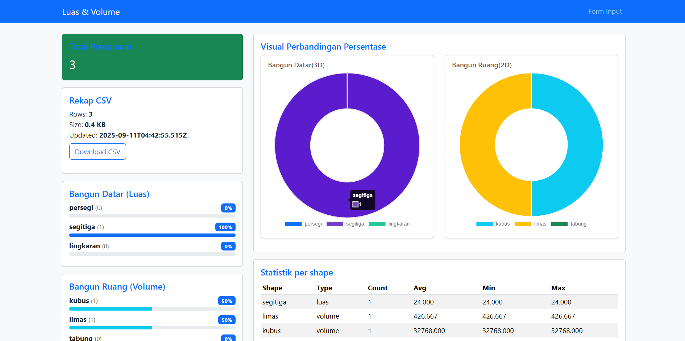

# Aplikasi Hitung Luas & Volume Siswa SD

Merupakan tugas praktik dari Uji Kompetensi Junior Web Program di LSP - Aplikasi sederhana Node.js + Express untuk siswa menghitung luas dan volume bangun datar/ruang, menyimpan hasil ke CSV dan MySQL, serta menampilkan dashboard statistik.

Persyaratan:
- Node.js 14+
- Express JS
- MySQL

## 📸 Screenshot

Setup singkat:
1. Copy file `.env.example` ke `.env` dan sesuaikan konfigurasi database.
2. Buat database di MySQL sesuai `DB_NAME`.
3. Jalankan `npm install` lalu `npm start`.

Tabel akan dibuat otomatis saat server berjalan. CSV akan disimpan di `data/records.csv`.

Shapes yang didukung:
- persegi (luas)
- segitiga (luas)
- lingkaran (luas)
- kubus (volume)
- limas (volume) - diasumsikan alas persegi
- tabung (volume)

Catatan: field parameter akan disimpan sebagai JSON. Jika Anda ingin menambah validasi atau fitur export lebih lanjut, saya bisa bantu.
